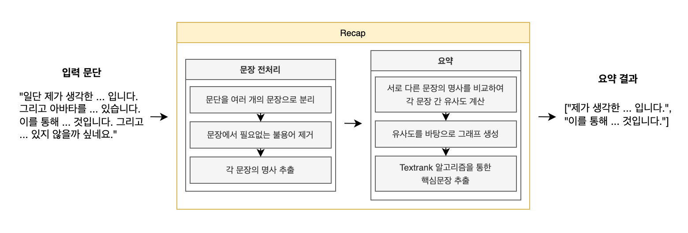

# Recap

Recap은 전달받은 텍스트를 TextRank 알고리즘을 통해 요약하여 반환하는 Java 라이브러리입니다.

## 사용 목적
Recap은 회의 내용을 자동으로 요약해주는데 목적을 가진 라이브러리입니다. 이를 통해 기존에 서기가 요약하던 회의 내용을 자동으로 요약함으로써 회의록 작성에 소요되는 시간을 절약할 수 있습니다. 또한, 회의 참여자들이 실시간으로 작성되는 요약본을 참고하여 회의 내용에 집중하고 의사결정에 참여함으로써 비대면 환경에서 업무를 더욱 원활하게 진행할 수 있도록 도와줄 것입니다.

## 사용 방법
Recap 라이브러리를 사용하기 위해서 형태소 분석을 위한 한나눔 라이브러리와 Recap 라이브러리를 추가합니다.

### 의존성 추가
```gradle
dependencies {
    ...
    implementation "kr.bydelta:koalanlp-hnn:2.1.4:assembly" // 한나눔 형태소 분석기
    implementation 'com.github.team-recap:recap:latest' // Recap
}
```

### 텍스트 요약
```java
// 요약할 텍스트
String text = "네. 제가 가져온 아이디어는 소셜 로그인을 쉽게 구축할 수 있는 라이브러리입니다. 웹 서비스를 제작해보신 분들을 알겠지만 소셜 로그인을 구현하는게 굉장히 어렵습니다. 소셜 플랫폼과의 연동뿐만아니라 해당 과정을 클라이언트와 연동하는 과정이 생각보다 많이 복잡합니다. 그래서 이 과정을 차라리 라이브러리화 해서 다양한 소셜 플랫폼을 지원할 뿐만아니라 쉽게 이용할 수 있도록 제작해보고 싶습니다.";

Summarizer summarizer = new Summarizer(); // Summarizer 객체 생성
String summarizedText = summarizer.summarize(text, // 요약할 텍스트
        Graph.SimilarityMethods.COSINE_SIMILARITY); // COSINE, JACCARD 유사도 측정법 사용 가능

System.out.println(summarizedText);
// ["소셜 플랫폼과의 연동뿐만아니라 해당 과정을 클라이언트와 연동하는 과정이 생각보다 많이 복잡합니다.", "이 과정을 라이브러리화 해서 다양한 소셜 플랫폼을 지원할 쉽게 이용할 수 있도록 제작해보고 싶습니다."]
```